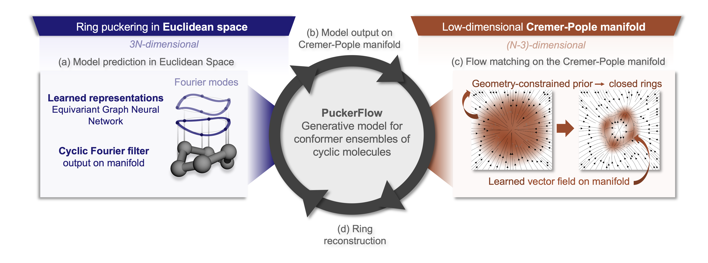

# PuckerFlow: Flow Matching in Cremer–Pople Coordinates

**Preprint**: _L. Schaufelberger*, A. Hartgers*, and K. Jorner, “Generating cyclic conformers with flow matching in Cremer-Pople coordinates”, arXiv, 2026._


**PuckerFlow** is a generative model for cyclic molecular conformer generation that operates directly in **Cremer–Pople (CP) puckering coordinates**, a low-dimensional internal coordinate system capturing the essential degrees of freedom of ring systems. By learning a **flow-matching** vector field on this manifold, PuckerFlow can efficiently generate **chemically valid, closed rings by design**, without requiring postprocessing or constraint enforcement. Across diverse ring systems, PuckerFlow achieves state-of-the-art results, outperforming GeoDiff, MCF, and RDKit in both precision and coverage across almost all metrics.

<p align="center">
  
</p>


## Setup

Create the Conda environment:

```bash
conda env create -f environment.yml
conda activate puckerflow

pip install torch==2.1.0+cu118 --index-url https://download.pytorch.org/whl/cu118
pip install pyg_lib torch_scatter torch_sparse torch_cluster torch_spline_conv -f https://data.pyg.org/whl/torch-2.1.0+cu118.html
pip install e3nn torch_geometric
```

Download and untar the dataset and pre-trained models from [Zenodo](https://doi.org/10.5281/zenodo.18225801). Place the extracted folders in the root directory. To convert the data to the required pickle format, run:
```bash
bash setup_data.sh
```

## Training

To train the model, run:
```bash
python3 train.py --config config/config_<SPLIT_ID>.yaml
```
where <SPLIT_ID> specifies the dataset split to use.

## Sampling
To perform sampling and get metrics, run:
```bash
python3 generate.py --config config/<CONFIG_NAME>.yaml
```

## Evaluate benchmarking algorithms
To get metrics for the other methods evaluated in this work, run:
```bash
python3 eval_comparisons.py --config config/<CONFIG_NAME>.yaml
```
For RDKit, this command generates the conformers, whereas for MCF and GeoDiff it uses samples generated after retraining the models on the puckering data.

## Citation
If you use PuckerFlow in your work, please cite:

```bibtex
@article{schaufelberger2026puckerflow,
title={Generating Cyclic Conformers with Flow Matching in Cremer-Pople Coordinates},
author={Schaufelberger, Luca and Hartgers, Aline and Jorner, Kjell},
journal={arXiv},
year={2026}
}
```
## Data availability

All data to reproduce the study can be found on [Zenodo](https://doi.org/10.5281/zenodo.18225801).

## Acknowledgements
This publication was created as part of NCCR Catalysis (grant numbers 180544 and 225147), a National Centre of Competence in Research funded by the Swiss National Science Foundation. The implementation builds on the codebase of [Torsional Diffusion](https://github.com/gcorso/torsional-diffusion), the [RING library](https://github.com/lucianlschan/RING), and [GeoMol](https://github.com/PattanaikL/GeoMol) (refer to [THIRD_PARTY_LICENCES](THIRD_PARTY_LICENSES) for comprehensive licensing details).

